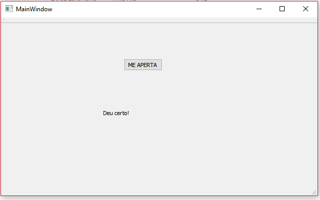
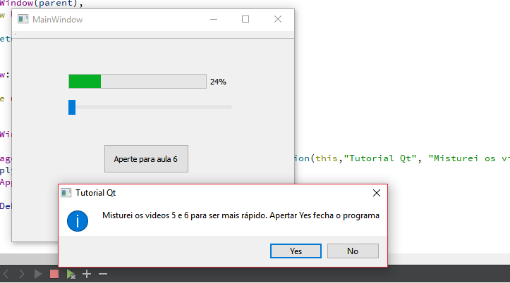
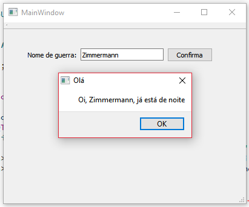

#ESCOPO:

O projeto visa a adaptação de um multímetro para possibilitar a transferência de dados
e controlar as funções do aparelho por um computador ou dispositivo de controle remoto com display.

Este projeto tem como objetivo a melhoria do desempenho de eletricistas em medições de circuitos, desde pequenas placas à caixas 
de força, permitindo maior acessibilidade e controle das informações, sem riscos de ocorrerem interferencias ou 
acidentes durante as medidas. Poderá servir também para obter diferentes dados de um circuito sem a necessidade de 
estar próximo ou interferir em tal.

#TUTORIAL:

O tutorial utilizado foi do seguinte link: <https://www.youtube.com/watch?v=Y1c-ieVO-UY> (onde começa a parte prática).
Aprendi o básico para começar a montar a User Interface.

Para a aula 4 fiz o basico:

Após apertar o botão temos:

Para ser mais sucinto, coloquei o conteúdo da aula 5 e 6 no mesmo arquivo:

As outras 27 aulas serão feitas conforme surja necessidade de mais ferramentas.

Alem dessas videoaulas, também fiz uma do link: <https://www.youtube.com/watch?v=NXSQf1GjjZU&list=PL0meOoSt675fF8xBzifArQyGwfZ-39SGA>
