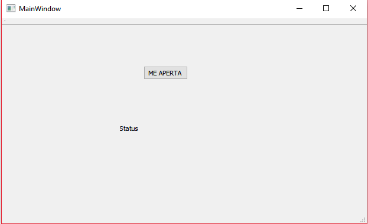
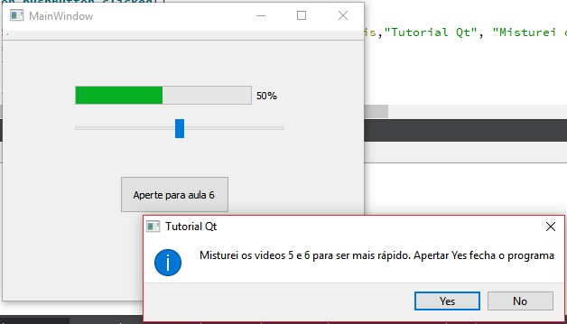
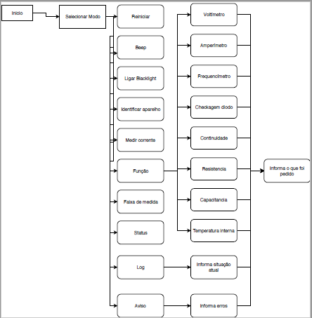
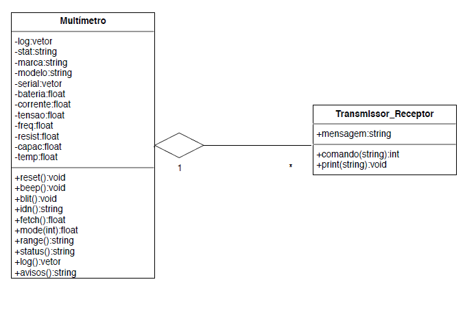
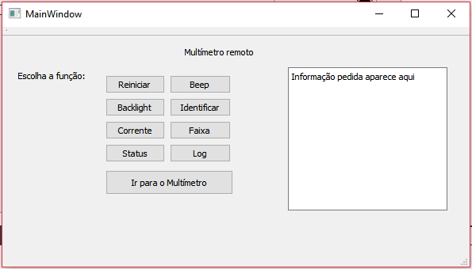
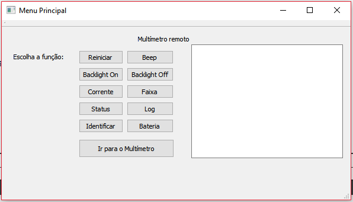

# ESCOPO:

O projeto visa a adaptação de um multímetro para possibilitar a transferência de dados
e controlar as funções do aparelho por um computador ou dispositivo de controle remoto com display.

Este projeto tem como objetivo a melhoria do desempenho de eletricistas em medições de circuitos, desde pequenas placas à caixas 
de força, permitindo maior acessibilidade e controle das informações, sem riscos de ocorrerem interferencias ou 
acidentes durante as medidas. Poderá servir também para obter diferentes dados de um circuito sem a necessidade de 
estar próximo ou interferir em tal.

# TUTORIAL:

O tutorial utilizado foi do seguinte link: <https://www.youtube.com/watch?v=Y1c-ieVO-UY> (onde começa a parte prática).
Aprendi o básico para começar a montar a User Interface.

Para a aula 4 fiz o basico:

Após apertar o botão temos:

Para ser mais sucinto, coloquei o conteúdo da aula 5 e 6 no mesmo arquivo:

As outras 27 aulas serão feitas conforme surja necessidade de mais ferramentas.

Alem dessas videoaulas, também fiz uma do link: <https://www.youtube.com/watch?v=NXSQf1GjjZU&list=PL0meOoSt675fF8xBzifArQyGwfZ-39SGA>

# DOCUMENTAÇÃO

O fluxograma do projeto foi:

E o diagrama de classes foi o seguinte:

# ESBOÇO*:

A ideia inicial é que primeiro o usuário abre a janela principal, com as funções a seguir:

Ainda irei implementar a possibilidade de ler a descrição da função ao deixar o cursor do mouse por cima do botão.
Clicando em "Ir para o Multímetro", uma nova janela será aberta, para explorar funções mais práticas do aparelho:

As funções disponíveis são intuitivas e há a possibilidade de voltar para o menu principal.
Em caso de erros ao ligar o aparelho (apertar On para começar as medições), uma mensagem de erro aparecerá.

*A GUI evoluiu durante o desenvolvimento do projeto, adicionando botões e uma nova janela.

# ADIÇÃO DOS ARQUIVOS

Os arquivos do esboço do projeto foram adicionados à pasta Esboco.
Para o funcionamento completo do programa falta encontrar as bibliotecas específicas do multímetro e fazer alguns ajustes na programação.
Tentarei acertar os erros e melhorar o programa o quanto antes.

# PARTE FINAL

Não consegui fazer com que para certos intervalos da roda da janela "Multímetro remoto" o LED mudasse o display.
Caso a mudança de função pela roda não esteja funcionando, ainda é possível mudar o modo do multímetro pela janela "Faixa".
Para conferir se as outras funções estão de acordo, seria necessária a biblioteca utilizada pelo multímetro, a qual não consegui baixar.
Para que seja possível testar a interface, deixei o código real (que precisaria das bibliotecas) como comentário.

# INSTRUÇÕES

Para a compilação do programa serão necessários todos os arquivos da pasta "Esboço" e o pacote de bibliotecas básicas do Qt.
(Principais: iostream, string, QString).
Para realizar o teste basico, basta dar Run no projeto "Esboço" (Qt).
Porém, para fazer um teste real com o multímetro, será necessário adicionar ao projeto as bibliotecas de fábrica do multímetro,
dando "include" em todos os arquivos .cpp e trocando os códigos provisórios pelos que estão em comentário.

Obs: 
Os códigos utilizados foram os do site: [Link do código utilizado como base](https://sigrok.org/wiki/Agilent_U12xxx_series#CONF.3F)
Para os modelos U123xx.